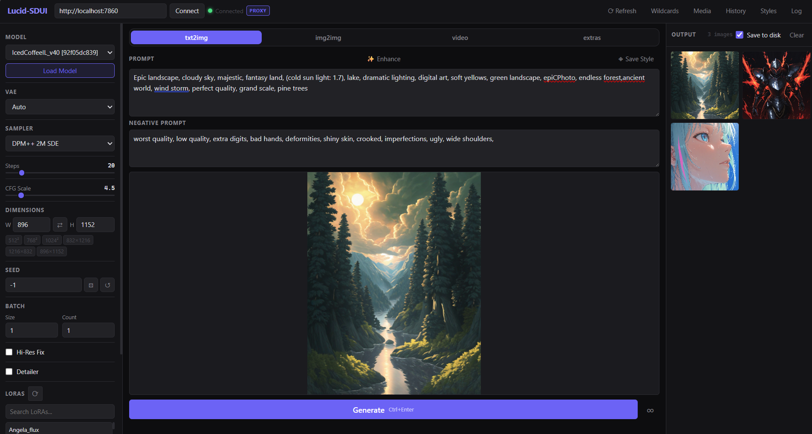

# Lucid-SDUI

A lightweight web frontend for [SDNext](https://github.com/vladmandic/automatic). Runs alongside SDNext and gives you a clean interface for generating images and video from any browser, including on mobile over LAN.



## Requirements

- SDNext running on `http://localhost:7860`
- Python 3.7+

## Setup

1. Start SDNext as normal
2. Double-click `serve.bat`, or run:
   ```
   python serve.py
   ```
3. Open `http://localhost:8080` in your browser

For LAN access (phone, tablet, etc.) use the IP address printed in the terminal when serve.py starts.

## Features

- txt2img, img2img, video generation
- Live generation preview (persists final image between generations)
- Styles system — save and apply named presets for prompts, sampler, steps, resolution, hi-res fix, and detailer settings
- LoRA browser with search and weight control
- Wildcard editor with folder support
- Media browser for saved outputs
- PNG info reader
- Image captioning and tagging
- Image upscaling
- Generation history with parameter restore
- Session log with download

## Configuration

The SDNext API address defaults to `http://localhost:7860`. To change it, edit `serve.py` and update the `API_TARGET` line at the top.

## Notes

- Live previews require SDNext to have intermediate image generation enabled. The UI sets this automatically on connect.
- The `serve.py` proxy handles CORS so the UI works the same whether accessed from localhost or over LAN.
